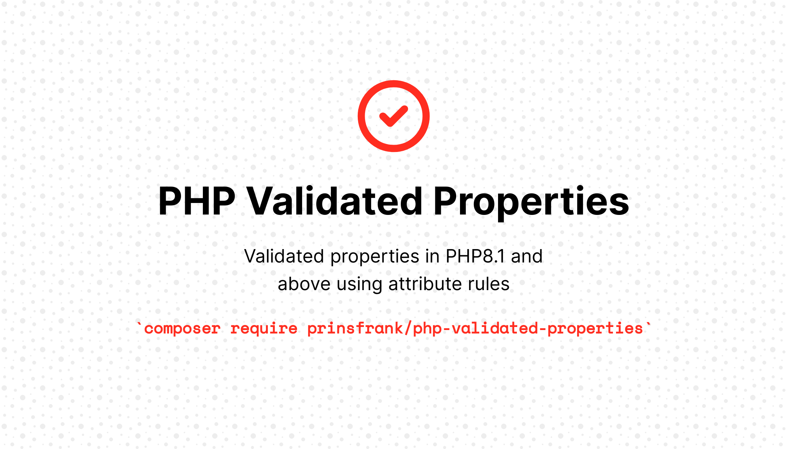

# PHP Validated Properties


[](https://scrutinizer-ci.com/g/PrinsFrank/php-validated-properties/build-status/main)
[](https://scrutinizer-ci.com/g/PrinsFrank/php-validated-properties/?branch=main)
[](https://scrutinizer-ci.com/g/PrinsFrank/php-validated-properties/?branch=main)


**Add Rule attributes to your model properties to make sure they are valid.**

## Why this package?

When validating external data coming from either a Request, an import or an API, common PHP packages allow you to validate that incoming data and give you that data back in an unstructured way. With this package you can directly add validation rules to your structured models instead;

```php
#[Url]
protected string $url;

#[Between(1, 100)]
protected int $nrOfItems;

#[Email]
protected string $email;
```

When a property is set to a value that doesn't adhere to these rules, a ValidationException will be thrown. (Which can be handled application specifically)

## Setup

To get up and running, simply run;

```shell
composer install prinsfrank/php-validated-properties
```

## Creating a validated model 
And extend the base model in ```PrinsFrank\PhpStrictModels\Model```;
```php
<?php

use PrinsFrank\PhpStrictModels\Model;

class ValidatedModel extends Model {

}
```


<details>
    <summary>If your models already extend another base model, you can also use the WithValidatedProperties trait instead</summary>

```php
<?php

use PrinsFrank\PhpStrictModels\WithValidatedProperties;
use Illuminate\Database\Eloquent\Model;

class ValidatedModel extends Model {
    use WithValidatedProperties;
}
```
</details>

## Adding validated properties

To add validation rules to properties, add them as attributes to protected and private properties:

```php
<?php

use PrinsFrank\PhpStrictModels\Model;
use PrinsFrank\PhpStrictModels\Rule\Between;
use PrinsFrank\PhpStrictModels\Rule\Url;

class ValidatedModel extends Model {
    #[Between(1,5)]
    protected int $nrOfItems;
    
    #[Url]
    protected string $url;
}
```

Due [to how PHP works internally](https://www.php.net/manual/en/language.oop5.overloading.php#object.set), it is not possible to validate public properties, so models extending the validated model or using the WithValidatedProperties trait will throw an exception when they contain public properties with Rule attributes.

## PHPStan support

To let PHPStan understand this package and to enable it to prevent any errors that can be detected using static analysis, a PHPStan plugin is included in this package. To add it to your phpstan.neon, simply add the following line to your includes section:
```neon
includes:
    - vendor/prinsfrank/php-validated-properties/development/PHPStan/extension.neon
```
